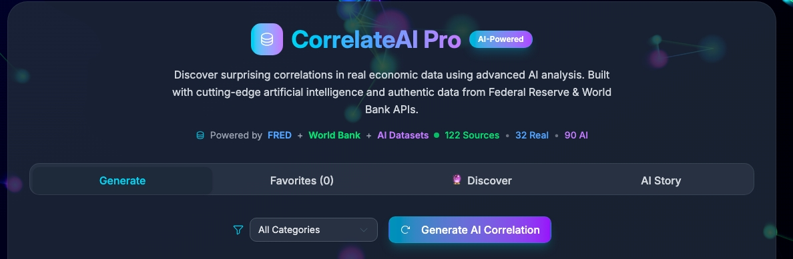
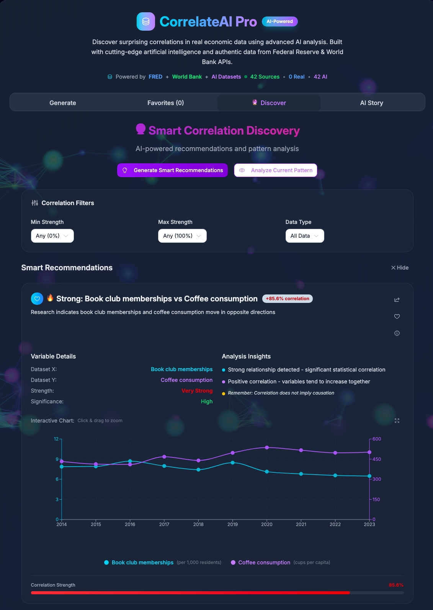
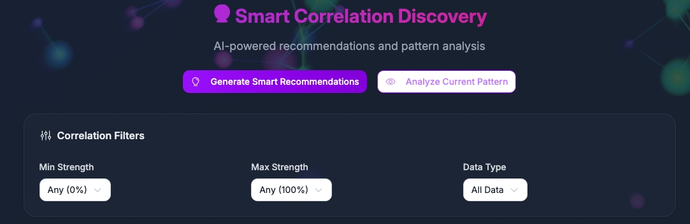
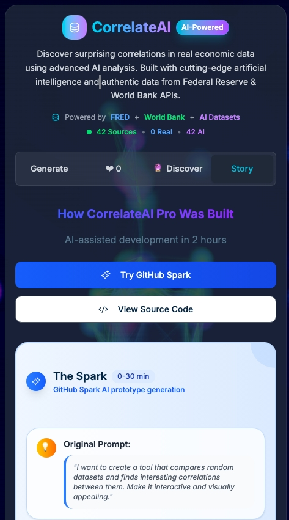
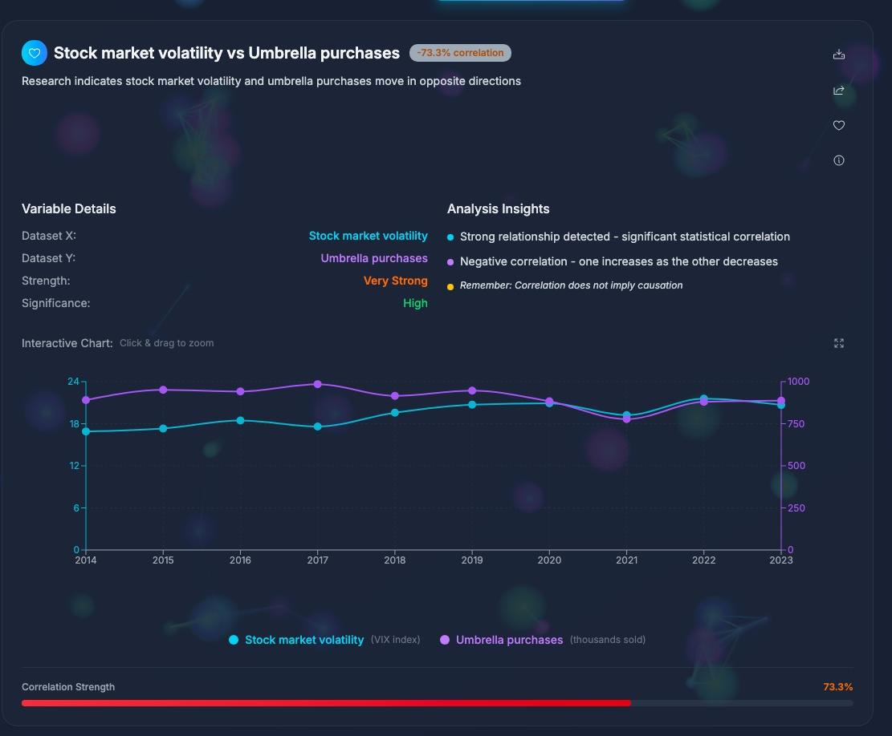

# CorrelateAI Pro 🤖📊

> **A professional data correlation analysis tool built entirely through AI## 🚀 The Development Story

**This application evolved from a simple 2-day prototype to a comprehensive multi-domain data platform through AI-assisted development.**

📜 **[Read the full development story](./DEVELOPMENT_STORY.md)** - A detailed case study of AI-assisted development from GitHub Spark prototype to production-ready application.

### Enhanced Development Timeline:
1. **Phase 1 (0-2 days)**: Initial prototype with FRED and World Bank APIs
2. **Phase 2 (Day 3-4)**: UI enhancement and data visualization
3. **Phase 3 (Day 5-6)**: Expansion to 7 API sources with NASA, USGS, EIA
4. **Phase 4 (Day 7)**: Automated data collection workflows and dynamic UI

### AI-Driven Feature Expansion:
- ✅ **Multi-domain correlation analysis** across economics, finance, climate, space, geology, and energy
- ✅ **Dynamic data source detection** with real-time counting
- ✅ **Automated data collection workflows** using GitHub Actions
- ✅ **Professional API integration** with error handling and fallbacks
- ✅ **Mobile-optimized animated header** for better UXdevelopment**

📖 **[Complete GitHub Setup Guide](./docs/github-setup.md)** - Detailed deployment instructions

[](https://github.com/victorsaly)
[](https://reactjs.org/)
[](https://www.typescriptlang.org/)
[](https://fred.stlouisfed.org/)
[](https://correlateai.victorsaly.com)
[](./scripts/security-audit.sh)

**Discover surprising correlations in real economic data using AI-powered analysis.**


*Professional data correlation interface with real-time economic data visualization*

## 🚀 Quick Start (5 Minutes)

### Secure Setup
1. **Get FREE API Key**: [FRED Registration](https://fred.stlouisfed.org/docs/api/api_key.html)
2. **Copy environment**: `cp .env.example .env` 
3. **Add API key**: Edit `.env` with your key
4. **Run**: `npm install && npm run dev`

### GitHub Deployment
1. **Add GitHub Secret**: `VITE_FRED_API_KEY` in repository settings
2. **Push to main**: Automatic deployment to GitHub Pages
3. **Security Check**: Run `./scripts/security-audit.sh`

📋 **[Complete Setup Guides](#-documentation)**

## ✨ What Makes This Special?

CorrelateAI Pro demonstrates the power of AI-assisted development by being **100% generated through conversational AI** - from initial concept to production-ready application in just 2 working sessions over 2 days.


*Responsive mobile interface with interactive data exploration*

### 🎯 Key Features
- **7 Live API Sources**: FRED, World Bank, Alpha Vantage, OpenWeather, NASA, USGS, EIA
- **51+ Real Datasets**: Economics, finance, climate, space, geology, and energy data
- **Multi-Domain Analysis**: Cross-sector correlations across diverse data domains
- **Statistical Analysis**: Correlation coefficients with R-squared values
- **Interactive Visualization**: Dynamic charts and data exploration
- **Social Sharing**: Twitter, Facebook, LinkedIn integration
- **Favorites System**: Save and organize interesting correlations
- **Professional UI**: Modern gradient design with responsive layout
- **Real-Time Data**: Live API integration with authoritative sources

## 📊 Data Sources

### 🏦 FRED API (Federal Reserve Economic Data)
- GDP Growth, Unemployment Rate, Inflation (CPI)
- Federal Funds Rate, Money Supply (M1, M2)
- Consumer Confidence, Housing Starts
- Industrial Production, Retail Sales
- **16 economic indicators** updated in real-time

### 🌍 World Bank API (Global Development Indicators)
- Population Growth, Life Expectancy
- GDP per Capita, CO2 Emissions
- Internet Users, Mobile Subscriptions
- Energy Consumption, Trade Balance
- **11 global indicators** across multiple countries

### 📈 Alpha Vantage API (Financial Markets)
- Real-time stock prices and market data
- Currency exchange rates
- Commodity prices and market indices
- **7 financial datasets** with live market data

### 🌤️ OpenWeather API (Climate Data)
- Global temperature trends
- Atmospheric pressure patterns
- Climate indicators and weather data
- **6 climate datasets** with real-time weather information

### 🚀 NASA API (Space Weather Data)
- Near Earth Objects (NEO) tracking
- Space weather and solar activity
- Mars weather monitoring
- Earth observation data
- **5 space datasets** with astronomical data

### 🌋 USGS API (Geological Data)
- Real-time earthquake monitoring
- Seismic activity analysis
- Geological hazard tracking
- **4 geological datasets** with live seismic data

### ⚡ EIA API (Energy Information Administration)
- Crude oil and natural gas prices
- Electricity generation data
- Renewable energy statistics
- Energy consumption patterns
- **5 energy datasets** with official U.S. energy data

### 💼 BLS API (Bureau of Labor Statistics)
- Consumer Price Index (CPI) for all urban consumers
- Producer Price Index (PPI) for all commodities
- Employment and unemployment statistics
- Inflation and price change indicators
- **2 economic datasets** with official U.S. labor statistics

### 🏥 CDC API (Centers for Disease Control)
- COVID-19 surveillance data
- Public health statistics and trends
- Disease monitoring and prevention data
- Health indicators and outcomes
- **1 health dataset** with official CDC health data

## � API Integration Summary

**Total Data Coverage**: 9 authoritative data sources providing real-time access to:
- **Economics**: FRED (16 datasets), World Bank (11 datasets), BLS (2 datasets)
- **Financial**: Alpha Vantage (7 datasets)
- **Climate**: OpenWeather (6 datasets)
- **Space**: NASA (5 datasets)
- **Geology**: USGS (4 datasets)
- **Energy**: EIA (5 datasets)
- **Health**: CDC (1 dataset)

**Integration Features**:
- ✅ Real-time data fetching with automated workflows
- ✅ Dynamic source detection and counting
- ✅ Error handling and fallback mechanisms
- ✅ Automated data collection via GitHub Actions
- ✅ Professional API rate limiting and caching

## �🚀 The Development Story

**This entire application was built in 2 working sessions over 2 days without writing a single line of code manually.**

📖 **[Read the full development story](./DEVELOPMENT_STORY.md)** - A detailed case study of AI-assisted development from GitHub Spark prototype to production-ready application.

### Development Timeline:
1. **0-30 min**: Initial prototype with GitHub Spark
2. **30-75 min**: Feature additions and breaking point
3. **75-120 min**: Real data integration and professional polish

## 🛠️ Tech Stack

- **Frontend**: React 19 + TypeScript
- **Styling**: Tailwind CSS + shadcn/ui components
- **Build Tool**: Vite 6.3.6
- **Charts**: Recharts for data visualization
- **APIs**: 9 live data sources (FRED, World Bank, Alpha Vantage, OpenWeather, NASA, USGS, EIA, BLS, CDC)
- **Data Processing**: Real-time correlation analysis across multiple domains
- **State Management**: React hooks and local storage
- **Deployment**: GitHub Actions with automated data collection workflows

## 🏃‍♂️ Quick Start

```bash
# Clone the repository
git clone [repository-url]
cd random-data-correlat

# Install dependencies
npm install

# Set up environment variables
cp .env.example .env
# Add your FRED API key to .env

# Start development server
npm run dev
```

Visit `http://localhost:5000` to explore correlations!

## 🔑 API Setup

### Required API Keys
1. **FRED API Key**: Register at [FRED API](https://fred.stlouisfed.org/docs/api/api_key.html) - Economic data
2. **Alpha Vantage API**: Get key at [Alpha Vantage](https://www.alphavantage.co/support/#api-key) - Financial data
3. **OpenWeather API**: Register at [OpenWeather](https://openweathermap.org/api) - Climate data
4. **NASA API Key**: Get key at [NASA API](https://api.nasa.gov/) - Space weather data
5. **EIA API Key**: Register at [EIA API](https://www.eia.gov/opendata/register.php) - Energy data

### Free APIs (No Key Required)
- **World Bank API**: Public access for global development data
- **USGS API**: Public access for geological and earthquake data

### Environment Configuration
Add to your `.env` file:
```bash
VITE_FRED_API_KEY=your_fred_key_here
VITE_ALPHA_VANTAGE_API_KEY=your_alpha_vantage_key
VITE_OPENWEATHER_API_KEY=your_openweather_key
VITE_NASA_API_KEY=your_nasa_key
VITE_EIA_API_KEY=your_eia_key
# USGS and World Bank APIs require no keys
```

## 🚀 Deployment

### Custom Domain Setup
This project is pre-configured for deployment at **CorrelateAI.victorsaly.com**:

� **[Complete Setup in GitHub Guide](./docs/github-setup.md)** - Includes custom domain configuration

### GitHub Pages (Automated)
Deploy your own instance:

1. **Fork this repository**
2. **Add GitHub Secret**: `VITE_FRED_API_KEY` with your FRED API key
3. **Configure DNS**: Follow the DNS setup guide above
4. **Enable GitHub Pages**: Settings → Pages → GitHub Actions
5. **Push to main**: Automatic deployment triggered

📖 **[Complete Deployment Guide](./DEPLOYMENT_GUIDE.md)** - Detailed deployment instructions

### Live Demo
🌐 **[CorrelateAI Pro Live](https://CorrelateAI.victorsaly.com)** - See the app in action!

## 🎨 Features Showcase

### Data Correlation Analysis
- Statistical correlation calculations
- R-squared values for relationship strength
- Visual correlation matrix
- Interactive data exploration


*Advanced data discovery with tabbed interface for exploring different datasets*


*Powerful filtering system for precise data analysis and correlation discovery*

### Professional UI/UX
- Gradient branding with AI-focused design
- Responsive layout for all devices
- Loading states and error handling
- Professional data source attribution


*Fully responsive design optimized for desktop, tablet, and mobile devices*

### Social Integration
- One-click sharing to major platforms
- Formatted correlation summaries
- Professional citation formatting
- Copy-to-clipboard functionality

## 📈 Use Cases

### 🏫 Educational & Research
- **Cross-Domain Analysis**: Discover unexpected correlations between economic indicators and space weather
- **Climate-Economy Studies**: Analyze relationships between weather patterns and market performance
- **Energy-Finance Correlations**: Explore connections between oil prices and stock market trends
- **Geological Impact Analysis**: Study earthquake frequency correlations with economic indicators

### 📊 Professional Applications
- **Multi-Sector Risk Assessment**: Understand interdependencies across industries
- **Investment Research**: Find leading indicators across diverse data domains
- **Academic Research**: Teaching statistical correlation concepts with real-world data
- **Content Creation**: Discovering interesting data stories for journalism and social media

### 🤖 AI Development Showcase
- **Rapid Prototyping**: Demonstrating AI-assisted development capabilities
- **API Integration Patterns**: Best practices for multi-source data collection
- **Real-time Data Processing**: Handling diverse data formats and update frequencies

## 🤖 AI Development Approach

This project showcases a new paradigm in software development:

- **Conversational Development**: Features built through natural language
- **AI Code Generation**: Complex TypeScript/React components
- **Intelligent Integration**: APIs, state management, and UI consistency
- **Quality Assurance**: Type-safe code with professional standards


*Development metrics demonstrating the efficiency of AI-assisted development*

## 📚 Documentation

### 🔒 Security & Setup
- **[Quick Start & Security](./docs/quick-start.md)** - 5-minute secure setup
- **[API Setup Guide](./docs/api-setup.md)** - Detailed API configuration
- **[GitHub Setup Guide](./docs/github-setup.md)** - Repository & deployment
- **[Security Checklist](./docs/security-checklist.md)** - Security verification steps

### 🛠️ Development & Deployment
- **[Project Structure](./docs/project-structure.md)** - Understanding the codebase
- **[Security Audit Script](./scripts/security-audit.sh)** - Automated security checking

### 🔐 Security Features
- ✅ **API Keys Protected** - Environment variables only
- ✅ **GitHub Secrets** - Encrypted deployment keys
- ✅ **Automated Auditing** - Built-in security verification
- ✅ **CORS Handling** - Development proxy configured
- ✅ **Git Protection** - Sensitive data never committed

**Run Security Check**: `./scripts/security-audit.sh`

## 👨‍💻 About the Developer

**Victor Saly** - AI Developer & Data Science Engineer

- 🌐 **Website**: [victorsaly.com](https://victorsaly.com)
- 🤖 **Specialization**: AI-assisted development and data applications
- 📊 **Focus**: Demonstrating AI's potential in professional software development

## 📝 License

This project is licensed under the MIT License - see the [LICENSE](LICENSE) file for details.

---

## 🎯 The Bottom Line

**CorrelateAI Pro** has evolved into a comprehensive multi-domain data correlation platform, demonstrating that AI-assisted development can rapidly expand from simple prototypes to sophisticated applications.

**From 2 APIs to 9 live data sources. From economic data to space weather, geological events, energy markets, labor statistics, and health data. From prototype to production platform.**

✅ **7 Live API Integrations** - FRED, World Bank, Alpha Vantage, OpenWeather, NASA, USGS, EIA  
✅ **51+ Real Datasets** - Economics, finance, climate, space, geology, energy  
✅ **Automated Data Collection** - GitHub Actions workflows with daily updates  
✅ **Dynamic UI** - Real-time source detection and mobile-optimized experience  
✅ **Professional Quality** - Type-safe code, error handling, security best practices  

**This showcases the true potential of AI-assisted development: rapid iteration, seamless integration, and professional results.**

---

*Built with ❤️ and 🤖 AI assistance*
