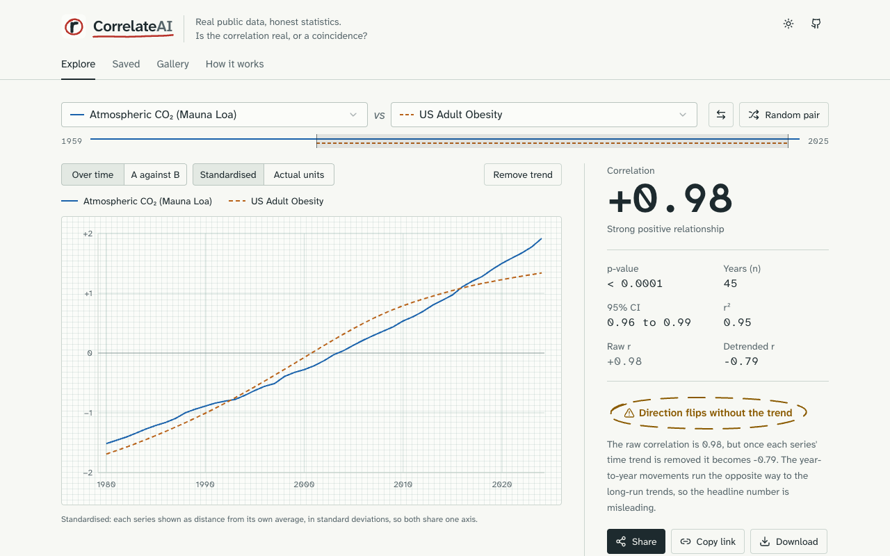
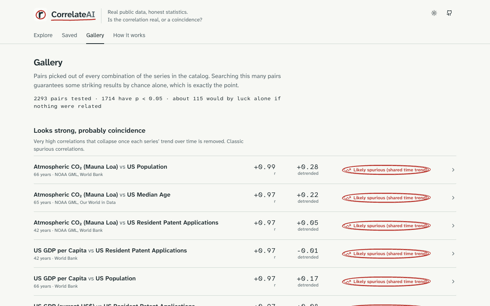
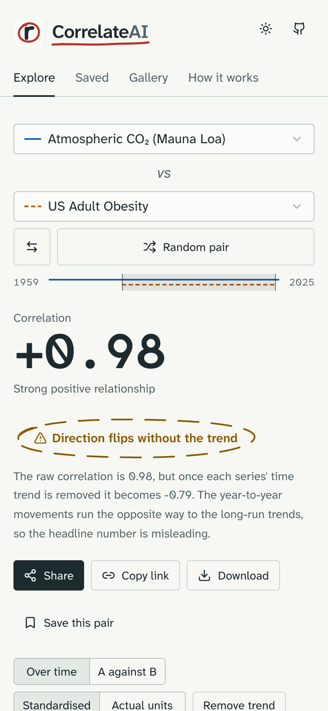

# CorrelateAI

Pair two real public datasets and get an honest verdict on whether their correlation is real or a coincidence. Built for journalists checking a claim, teachers and students learning why correlation isn't causation, and analysts exploring public indicators.

**Live: [correlateai.victorsaly.com](https://correlateai.victorsaly.com)**



Two things that rise over the same decades will almost always correlate, whether or not they are related. CorrelateAI computes every statistic in the browser from source-linked public data, then checks whether the link survives once each series' time trend is removed. Despite the name, there is no AI in the product: just statistics you can check.

## What it offers

For any pair of series:

- **Pearson r**, computed only on the years both series cover
- **p-value** (two-tailed t-test) and a **95% confidence interval** (Fisher z)
- **Detrended r**: the correlation after subtracting each series' straight-line trend
- **A plain-language verdict**: *Not significant*, *Likely spurious (shared time trend)*, *Direction flips without the trend*, *Interpret with caution*, or *Holds up after detrending*
- **Charts** over time or as a scatter (A against B), standardised or in actual units, with or without the trend

Every result has a reproducible link (`/?a=<series>&b=<series>`). Pairs that share at least 15 years also get a static, indexable page at `/pairs/<a>--vs--<b>/`. Any result can be exported as a PNG card, as CSV, or as JSON with sources and statistics.

| View | What it does |
|---|---|
| **Explore** | Pick two series, or a random pair |
| **Gallery** | Notable pairs from every combination, with a note on how many would look significant by chance |
| **Saved** | Pairs saved in your browser (no account needed) |
| **How it works** | The methodology, a calculator for your own numbers, and every source |

<p>
  
  
</p>

The verdict rules live in [`src/lib/correlationStats.ts`](src/lib/correlationStats.ts) and are covered by tests.

## Data

The catalog has 72 yearly series, mostly for the US, all from public sources that need no API key:

| Source | Examples |
|---|---|
| World Bank | US GDP, population, life expectancy, inflation, R&D spending, infant mortality |
| Our World in Data | CO₂ emissions, obesity, renewables, meat and egg consumption, marriage rate, working hours |
| NOAA | Atmospheric CO₂ (Mauna Loa), global methane, global temperature anomaly |
| NSIDC | Arctic sea ice extent (September) |
| SILSO | Sunspot number |
| U.S. Treasury | Federal debt outstanding |
| USGS | Worldwide M5+ and M6+ earthquakes per year |
| Open-Meteo (ERA5) | Annual mean temperature for London, New York, Sydney and Tokyo |
| Frankfurter (ECB) | USD to EUR, GBP and JPY |

`npm run collect:real` runs every collector in [`scripts/collectors/`](scripts/collectors/), and a weekly GitHub Action runs it on `main`. Each series is written to `public/data/<id>.json` as `[{ year, value }]`. The catalog the app loads is `public/data/real_list.json`, with a source URL for every series. If a source fails, or returns far fewer points than last time, the run keeps that series' last good copy, so saved pairs and `/pairs/` pages don't disappear.

To check the catalog and every file before committing data:

```bash
node scripts/validate-real-data.mjs
```

## Tech stack

React 19, TypeScript, Vite, Tailwind CSS v4, Radix primitives and Recharts. Vitest for unit tests, Playwright (with axe) for end-to-end tests. Static hosting on GitHub Pages; no backend. The design system is in [`DESIGN.md`](DESIGN.md).

## Run locally

Requires Node 18 or later. No API keys are needed.

```bash
npm install
npm run dev          # http://localhost:5180
npm test             # unit tests: statistics, year alignment, share URLs, pair pages
npm run test:e2e     # Playwright on the production build, desktop and mobile, incl. axe a11y and SEO checks
npm run type-check
npm run lint
npm run build        # type-check, Vite build, then prerender /pairs/ pages and sitemap.xml
npm run collect:real # refresh the data series
npm run brand        # regenerate favicons and app icons from src/app/logo.json
```

The build makes no network calls. It reads only the committed data in `public/data/`. [`scripts/build-pages.mjs`](scripts/build-pages.mjs) prerenders the pair pages from the app's own TypeScript, so a static page can never disagree with the live app.

## Deploy

Every push to `main` runs unit tests, the build and the Playwright suite, then deploys `dist/` to GitHub Pages ([`.github/workflows/deploy.yml`](.github/workflows/deploy.yml)). In the repository settings, the Pages source must be **GitHub Actions**. Branch deploy would serve the unbuilt development `index.html`.

## Limits

The p-value assumes each year is independent of the last. Yearly series rarely are, so p-values are somewhat optimistic. Detrending helps, but it does not fully correct for this. A correlation that holds up still says nothing about cause.

Custom uploads, embeds and an API are planned but not built. There is a waitlist link on the site's *How it works* page.

## License

[MIT](LICENSE)

Made by [Victor Saly](https://victorsaly.com).
