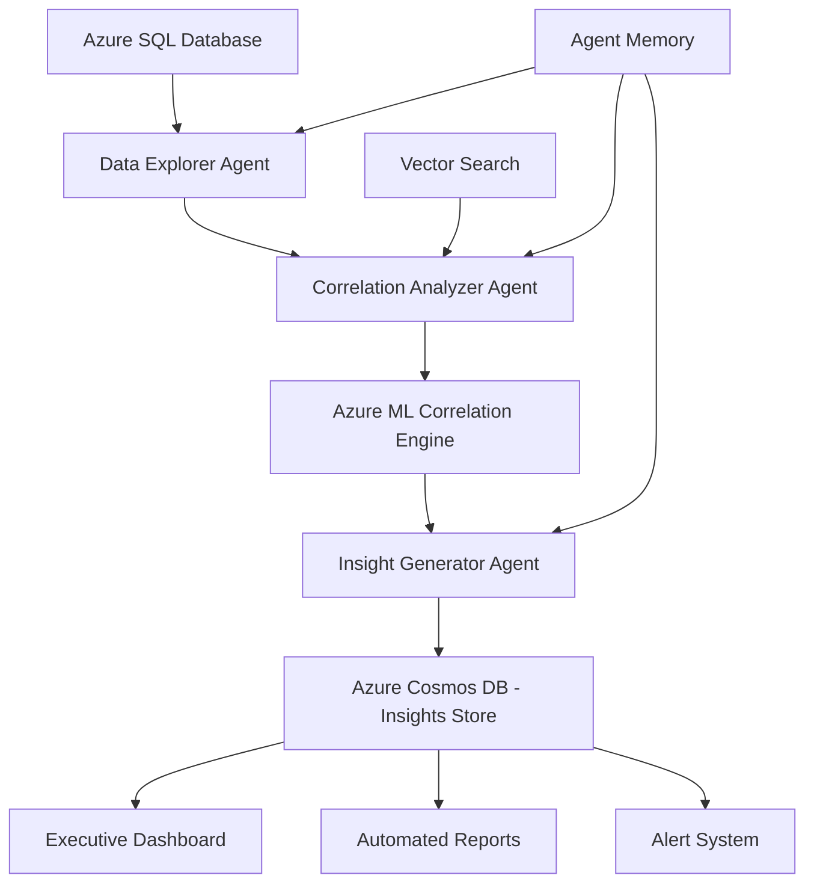

# CorrelateAI Enterprise - System Architecture

## Overview
CorrelateAI Enterprise is built on a distributed, cloud-native architecture designed for enterprise-scale data correlation analysis and business intelligence.

## Architecture Layers

### 1. Stakeholder Layer
**Purpose**: Present insights and recommendations to business users
**Components**:
- **Executive Dashboard**: High-level correlation insights with business impact metrics
- **Automated Reports**: Scheduled reports for different stakeholder groups
- **Alert System**: Real-time notifications for anomalies and opportunities

**Technologies**:
- React/TypeScript frontend
- Power BI embedded analytics
- Azure App Service for hosting
- Azure SignalR for real-time updates

### 2. AI Agent Orchestrator
**Purpose**: Coordinate multiple specialized AI agents for comprehensive analysis
**Core Service**: Azure AI Foundry Agent Service

**Agent Types**:

#### Data Explorer Agent
- **Responsibilities**: 
  - Database schema discovery and mapping
  - Data profiling and quality assessment
  - Metadata extraction and cataloging
- **Capabilities**:
  - Automatic table relationship detection
  - Data type and pattern analysis
  - Quality scoring and anomaly detection

#### Correlation Analyzer Agent
- **Responsibilities**:
  - Statistical correlation analysis
  - Machine learning pattern detection
  - Cross-table relationship discovery
- **Capabilities**:
  - Pearson/Spearman correlation analysis
  - Time-series correlation with lag detection
  - Multi-dimensional relationship mapping

#### Insight Generator Agent
- **Responsibilities**:
  - Business context interpretation
  - Recommendation generation
  - Report composition
- **Capabilities**:
  - Natural language insight explanation
  - Business impact quantification
  - Actionable recommendation synthesis

### 3. Correlation Engine
**Purpose**: Advanced analytics and machine learning for correlation detection

**Components**:

#### Azure Machine Learning
- **AutoML Models**: Automated model creation for prediction and classification
- **Time Series Analysis**: Seasonal pattern detection and forecasting
- **Predictive Models**: Revenue impact and trend prediction

#### Custom Analytics Engine
- **Statistical Analysis**: Advanced correlation algorithms
- **Cross-table Analysis**: Multi-source data correlation
- **Trend Analysis**: Historical pattern recognition

#### Vector Search
- **Semantic Similarity**: Find conceptually related data points
- **Pattern Matching**: Historical correlation pattern lookup
- **Anomaly Detection**: Unusual correlation pattern identification

### 4. Data Layer
**Purpose**: Secure, scalable data storage and management

#### Azure SQL Database
- **Financial Data**: Revenue, costs, budgets, transactions
- **Sales Data**: Orders, customers, products, territories
- **Operational Data**: HR, manufacturing, supply chain metrics
- **Security**: Row-level security, encryption, audit trails

#### Azure Cosmos DB
- **Agent Memory**: Conversation history and learned patterns
- **Insights Store**: Generated insights and recommendations
- **Vector Embeddings**: Semantic search capabilities
- **Configuration**: Agent settings and business rules

#### Azure Storage
- **Reports**: Generated reports and visualizations
- **Artifacts**: Models, datasets, and analysis results
- **Cache**: Frequently accessed correlation results
- **Backup**: Historical data and recovery points

## Security Architecture

### Authentication & Authorization
- **Azure Entra ID**: Identity management and SSO
- **Managed Identity**: Secure service-to-service authentication
- **RBAC**: Role-based access control for data and features
- **Zero Trust**: Assume breach security model

### Data Protection
- **Encryption**: At-rest and in-transit encryption
- **Key Management**: Azure Key Vault for secrets
- **Network Security**: Private endpoints and VNet integration
- **Audit**: Comprehensive logging and monitoring

## Scalability Design

### Horizontal Scaling
- **Microservices**: Independent scaling of components
- **Container Orchestration**: Azure Kubernetes Service (AKS)
- **Load Balancing**: Azure Load Balancer and Application Gateway
- **Auto-scaling**: Demand-based resource allocation

### Performance Optimization
- **Caching Strategy**: Multi-level caching with Redis
- **Connection Pooling**: Efficient database connections
- **Batch Processing**: Bulk data operations
- **CDN**: Global content delivery for dashboards

## Deployment Architecture

### Infrastructure as Code
- **Bicep Templates**: Azure resource provisioning
- **GitHub Actions**: CI/CD pipeline automation
- **Environment Management**: Dev, staging, production environments
- **Configuration Management**: Azure App Configuration

### Monitoring & Observability
- **Azure Monitor**: Application and infrastructure monitoring
- **Application Insights**: Performance and usage analytics
- **Log Analytics**: Centralized logging and analysis
- **Alerts**: Proactive issue detection and notification

## Data Flow

## Business Logic Flow

1. **Discovery Phase**: Data Explorer Agent scans database schemas and profiles data
2. **Analysis Phase**: Correlation Analyzer Agent runs statistical and ML analysis
3. **Enhancement Phase**: Vector search finds similar historical patterns
4. **Insight Phase**: Insight Generator Agent creates business-context recommendations
5. **Presentation Phase**: Stakeholder interfaces present actionable insights
6. **Learning Phase**: Agent memory stores successful patterns for future use

## Technology Stack

### Backend Services
- **.NET 8**: Core business logic and APIs
- **Python**: Machine learning and data science
- **Azure Functions**: Serverless compute for agents
- **Azure Container Apps**: Microservices hosting

### Frontend & Visualization
- **React 18**: Modern web UI framework
- **TypeScript**: Type-safe development
- **Chart.js/D3.js**: Custom data visualizations
- **Power BI Embedded**: Enterprise analytics

### Data & AI
- **Azure SQL Database**: Structured data storage
- **Azure Cosmos DB**: NoSQL and vector storage
- **Azure Machine Learning**: ML model training and inference
- **Azure AI Foundry**: Agent orchestration and management

### DevOps & Infrastructure
- **Azure DevOps**: Source control and project management
- **GitHub Actions**: CI/CD automation
- **Azure Monitor**: Observability stack
- **Azure Key Vault**: Secrets management

## Competitive Advantages

1. **Autonomous Operation**: Minimal human intervention required
2. **Business Context**: AI understands business impact, not just statistics
3. **Multi-Source Analysis**: Correlates across different data systems
4. **Continuous Learning**: Improves recommendations over time
5. **Enterprise Ready**: Built-in security, compliance, and scalability