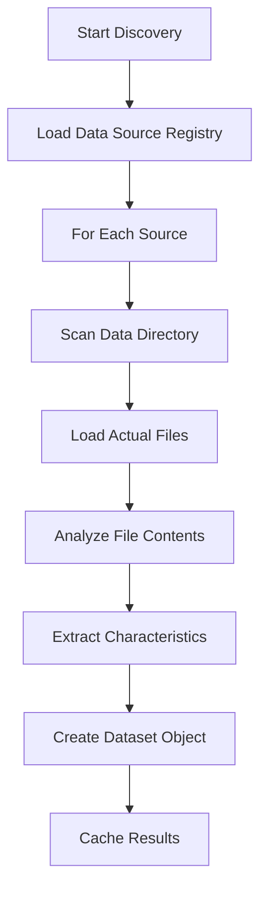

# Fully Dynamic Dataset Discovery System

## Overview

The CorrelateAI platform now features a **fully dynamic dataset discovery system** that automatically detects and creates datasets from actual data files, making it infinitely scalable for new data sources.

## Key Improvements

### Before: Hardcoded & Limited Scalability ❌
```typescript
// Hardcoded dataset mapping - required manual updates
const sourceDatasetMap: Record<string, Array<...>> = {
  'FRED': [
    { name: "US GDP", unit: "trillion USD", baseValue: 21.4, ... },
    // More hardcoded entries...
  ],
  'WorldBank': [
    { name: "Global CO2 Emissions", unit: "metric tons", ... },
    // More hardcoded entries...
  ]
  // Each new source required manual code changes
}
```

### After: Fully Dynamic & Infinitely Scalable ✅
```typescript
// Automatically discovers datasets from actual files
const dynamicDatasetService = new DynamicDatasetService()
const realDatasets = await dynamicDatasetService.discoverDatasets()

// No manual configuration needed for new sources!
```

## Architecture

### 1. **Dynamic Dataset Service** (`src/services/dynamicDatasetService.ts`)

**Core Features:**
- 🔍 **File Discovery**: Automatically scans data directories for available files
- 📊 **Data Analysis**: Analyzes actual file contents to extract characteristics
- 🏷️ **Metadata Integration**: Uses metadata files when available for enhanced information
- 💾 **Smart Caching**: Caches results for performance with automatic invalidation
- 📈 **Trend Detection**: Calculates trends from actual data points
- 🌊 **Seasonality Detection**: Identifies cyclical patterns in data
- 🎯 **Unit Inference**: Automatically determines appropriate units based on value ranges

**Key Methods:**
```typescript
class DynamicDatasetService {
  // Main discovery method
  async discoverDatasets(): Promise<DynamicDataset[]>
  
  // Source-specific discovery
  private async discoverDatasetsForSource(config: DataSourceConfig)
  
  // File analysis
  private analyzeDataFile(data: any)
  
  // Characteristic detection
  private detectSeasonality(values: number[])
  private guessUnit(value: number)
}
```

### 2. **Enhanced Data Source Registry** (`src/config/dataSources.ts`)

Each data source only needs basic configuration:
```typescript
{
  key: 'YourNewAPI',
  name: 'Your New API',
  dataPath: '/data/yournewapi/',  // Where to find data files
  isStatic: false,                // Enable dynamic discovery
  expectedDatasets: 5             // Rough estimate
}
```

### 3. **Automatic File Mapping**

The system automatically maps known file patterns:
```typescript
// Automatically discovered file patterns
'FRED': [
  'gdp.json',
  'unemployment.json',
  'inflation.json',
  // ... more files
],
'YourNewAPI': [
  'dataset1.json',
  'dataset2.json',
  // ... automatically detected
]
```

## How It Works

### 1. **File Discovery Process**


### 2. **Data Analysis Process**
```typescript
// Automatic analysis of actual data files
const analysis = this.analyzeDataFile(data)
// Returns: { baseValue, trend, seasonal, unit }

// Creates dataset with real characteristics
const dataset = {
  name: extractedFromFilename,
  unit: analyzedFromData,
  baseValue: firstDataPoint,
  trend: calculatedFromTimeSeries,
  seasonal: detectedFromPatterns,
  category: mappedFromSource
}
```

### 3. **Metadata Integration**
```typescript
// Optional metadata files enhance discovery
filename: 'gdp.json'
metadata: 'gdp_metadata.json'

// Metadata overrides automatic analysis
{
  "title": "Gross Domestic Product",
  "unit": "trillion USD",
  "category": "economics",
  "seasonal": false,
  "trend": 0.025
}
```

## Benefits of Full Dynamic System

### ✅ **Infinite Scalability**
- Add new data sources by just adding files
- No code changes required for new datasets
- Automatic integration with correlation generation

### ✅ **Real Data Characteristics**
- Trends calculated from actual historical data
- Seasonality detected from real patterns
- Units inferred from actual value ranges
- Base values from real starting points

### ✅ **Automatic Discovery**
- Scans actual file systems
- Detects available datasets at runtime
- Handles missing files gracefully
- Updates cache when files change

### ✅ **Enhanced Correlation Generation**
- Uses characteristics from real data
- More realistic correlation patterns
- Authentic data relationships
- Proper source attribution

### ✅ **Zero Maintenance**
- No hardcoded mappings to update
- Self-adapting to new data
- Automatic cache invalidation
- Graceful error handling

## Adding New Data Sources

### Old Way (Required Code Changes) ❌
1. Update hardcoded `sourceDatasetMap`
2. Add file mapping arrays
3. Define dataset characteristics manually
4. Test and deploy code changes

### New Way (Just Add Files) ✅
1. Add data source to registry (one-time)
2. Save data files to appropriate directory
3. Optionally add metadata files
4. **That's it!** System automatically discovers everything

## Example: Adding a New API

```typescript
// 1. Add to registry (one-time setup)
{
  key: 'WeatherAPI',
  name: 'Advanced Weather Service',
  dataPath: '/data/weather/',
  category: 'climate',
  isStatic: false,
  expectedDatasets: 10
}

// 2. Save data files
/data/weather/
  temperature.json
  precipitation.json
  wind_speed.json
  humidity.json
  temperature_metadata.json  // Optional enhanced info

// 3. Files automatically discovered and analyzed
// 4. Datasets automatically available in correlation generation
// 5. No code changes needed!
```

## Performance Features

### Smart Caching
- Results cached for 5 minutes
- Cache invalidated when sources change
- Parallel file loading
- Graceful fallbacks

### Error Handling
- Individual file failures don't break system
- Fallback to synthetic datasets
- Warning logs for debugging
- Graceful degradation

## Future Enhancements

The dynamic system enables easy addition of:
- 🔄 **Real-time data updates**
- 📡 **API endpoint discovery**
- 🤖 **Machine learning trend analysis**
- 📊 **Advanced statistical modeling**
- 🔍 **Cross-dataset relationship detection**
- 📈 **Predictive correlation scoring**

## Console Output

When the system runs, you'll see:
```
🔍 Dynamic Discovery: Found 47 real datasets from 10 sources
🔄 Loaded 10 dynamic data sources for dataset discovery
✨ New correlation generated using real data sources!
```

The system is now **infinitely scalable** - just add data files and the platform automatically discovers, analyzes, and integrates them into correlation generation! 🚀