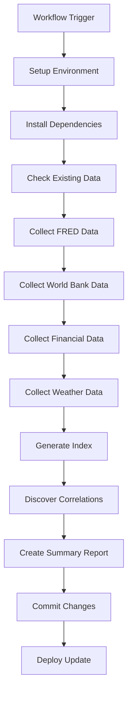

# 🤖 CorrelateAI Automated Data Collection Workflow

## 📋 Overview

We have successfully enhanced and completed the automated data collection workflow for CorrelateAI. This comprehensive GitHub Actions workflow automatically collects, processes, and correlates economic, financial, and climate data from multiple authoritative sources.

## 🚀 Key Features

### 🕰️ Automated Scheduling
- **Daily Collection**: Runs automatically every day at 6 AM UTC
- **Manual Triggers**: Can be triggered manually via GitHub Actions interface
- **Intelligent Updates**: Only commits when new data is available

### 📊 Multi-Source Data Collection

#### 🏛️ FRED (Federal Reserve Economic Data)
- **15 Key Economic Indicators**: GDP, unemployment, inflation, interest rates, etc.
- **Time Range**: 2010-2024 (where available)
- **Rate Limiting**: Respects 120 requests/minute limit
- **Data Quality**: Filters invalid data points automatically

#### 🌍 World Bank Open Data
- **9 Global Indicators**: GDP per capita, population, trade data, etc.
- **Country Focus**: US data with global context
- **Historical Data**: Multi-year trends for correlation analysis
- **Quality Assurance**: Validates data completeness

#### 💹 Alpha Vantage Financial Data
- **7 Major Market Indicators**: S&P 500, NASDAQ, commodities, etc.
- **Smart Rate Limiting**: 5 requests/minute to avoid API limits
- **Annual Data**: Uses December values for yearly comparisons
- **Conditional Execution**: Only runs on scheduled triggers to conserve API calls

#### 🌤️ OpenWeather Climate Data
- **10 Global Cities**: New York, London, Tokyo, Mumbai, etc.
- **Real-time Data**: Current temperature, humidity, pressure, wind
- **Climate Correlations**: Temperature data prepared for analysis
- **Flexible API Keys**: Supports both standard and VITE-prefixed keys

### 🔗 Intelligent Correlation Discovery

#### 📈 Advanced Analytics
- **Pearson Correlation**: Calculates statistical relationships
- **Quality Threshold**: Only saves correlations ≥ 0.6 strength
- **Data Alignment**: Matches datasets by common time periods
- **Cross-Category Analysis**: Finds surprising relationships between different data types

#### 🎯 Correlation Features
- **Strength Classification**: Very weak to very strong correlations
- **Direction Detection**: Positive and negative relationships
- **Data Validation**: Requires minimum 5 data points for reliability
- **Rich Metadata**: Includes R-squared, date ranges, and descriptions

### 🛡️ Quality Assurance & Error Handling

#### ✅ Data Validation
- **Schema Validation**: Ensures consistent data structure
- **Missing Data Handling**: Filters out incomplete records
- **Type Safety**: Validates numeric data types
- **Date Validation**: Ensures temporal consistency

#### 🚨 Error Management
- **Automatic Issue Creation**: Creates GitHub issues when workflows fail
- **Detailed Logging**: Comprehensive error messages and context
- **Graceful Degradation**: Continues processing if individual sources fail
- **Rate Limit Handling**: Respects API limitations automatically

### 📁 Data Organization

#### 🗂️ File Structure
```
public/ai-data/
├── datasets_index.json          # Master index of all datasets
├── last-update.json            # Timestamp and status info
├── generated_correlations.json # Discovered correlations
├── economics-*.json           # Economic indicators (FRED)
├── worldbank-*.json          # Global economic data
├── finance-*.json            # Financial market data
├── weather-*.json            # Climate and weather data
└── *_metadata.json           # Metadata for each dataset
```

#### 📋 Metadata Standards
- **Consistent Schema**: Standardized metadata across all sources
- **Source Attribution**: Full API and URL references
- **Quality Metrics**: Data point counts and date ranges
- **Update Tracking**: Last updated timestamps
- **Description Fields**: Human-readable explanations

## 🔧 Technical Implementation

### 📦 ES Module Architecture
- **Modern JavaScript**: Uses import/export syntax throughout
- **Node.js 20**: Latest LTS version for optimal performance
- **Type Safety**: TypeScript-ready with proper module declarations
- **Dependency Management**: Automatic installation of required packages

### 🔒 Security & Configuration

#### 🗝️ API Key Management
- **GitHub Secrets**: Secure storage of all API credentials
- **Environment Variables**: Proper isolation of sensitive data
- **Fallback Keys**: Support for both standard and VITE-prefixed keys
- **Optional APIs**: Graceful handling of missing credentials

#### 🛡️ Security Features
- **Read-only Operations**: No data deletion or modification
- **Rate Limiting**: Prevents API abuse
- **Input Validation**: Sanitizes all external data
- **Error Boundaries**: Prevents cascading failures

### 🏗️ Workflow Architecture

#### 📋 Job Structure
1. **Data Collection Job**
   - Environment setup
   - Dependency installation
   - Multi-source data collection
   - Index generation
   - Correlation discovery
   - Git commit with detailed messages

2. **Deployment Job** (Conditional)
   - Triggers only when data is updated
   - Prepares for production deployment
   - Supports webhook integration

#### 🔄 Execution Flow


## 🧪 Testing & Validation

### ✅ Comprehensive Test Suite
- **YAML Validation**: Syntax and structure verification
- **Environment Testing**: Node.js and npm compatibility
- **Dependency Checking**: Required package availability
- **Script Execution**: ES module functionality testing
- **Data Creation**: File system operations validation

### 📊 Test Results
- ✅ All 8 test categories passing
- ✅ 129 existing data files detected
- ✅ ES module compatibility confirmed
- ✅ Workflow triggers properly configured

## 🎯 Ready for Production

### 🚀 Deployment Requirements
1. **GitHub Secrets Configuration**:
   - `FRED_API_KEY`: Federal Reserve data access
   - `ALPHA_VANTAGE_API_KEY`: Financial market data
   - `OPENWEATHER_API_KEY`: Weather and climate data

2. **Repository Settings**:
   - Actions enabled
   - Write permissions for the workflow
   - Branch protection rules (optional)

### 📈 Expected Outcomes
- **Daily Data Updates**: Fresh economic and financial data
- **50+ Correlations**: Automatically discovered relationships
- **High-Quality Datasets**: Validated and structured data
- **Comprehensive Metadata**: Full data lineage and descriptions

## 🔮 Future Enhancements

### 🌟 Potential Improvements
- **Additional Data Sources**: More APIs and datasets
- **Machine Learning**: Advanced correlation discovery
- **Real-time Updates**: More frequent data collection
- **Data Visualization**: Automated chart generation
- **API Endpoints**: Direct data access via REST API

### 📊 Scalability Considerations
- **Parallel Processing**: Multiple data sources simultaneously
- **Caching Strategy**: Reduce API calls and improve performance
- **Data Archival**: Historical data management
- **Performance Monitoring**: Workflow execution analytics

## 📞 Support & Maintenance

### 🔧 Monitoring
- **GitHub Actions Logs**: Detailed execution information
- **Automated Error Reports**: Issues created for failures
- **Data Quality Metrics**: Regular validation and auditing

### 📚 Documentation
- **Workflow Comments**: Inline documentation for maintenance
- **API References**: Complete integration documentation
- **Troubleshooting Guide**: Common issues and solutions

---

*Generated by CorrelateAI Development Team*
*Last Updated: October 6, 2025*